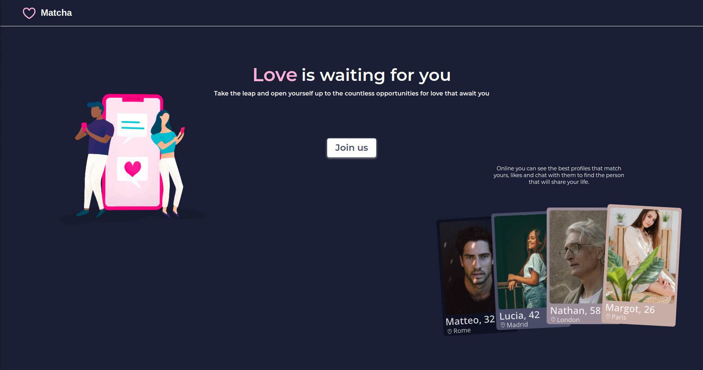
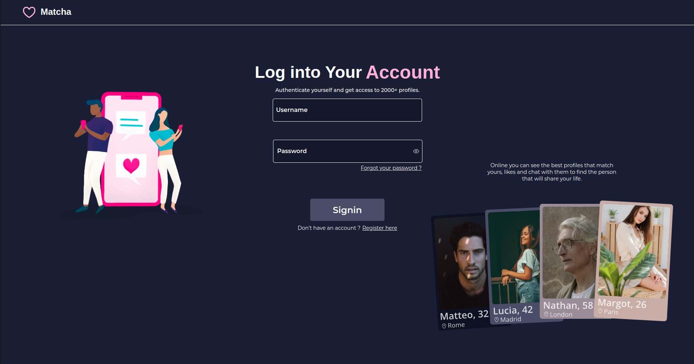
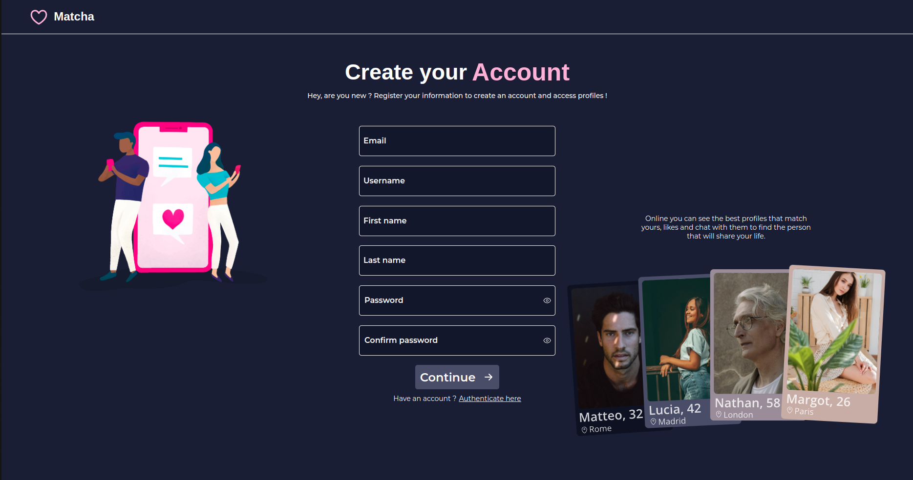
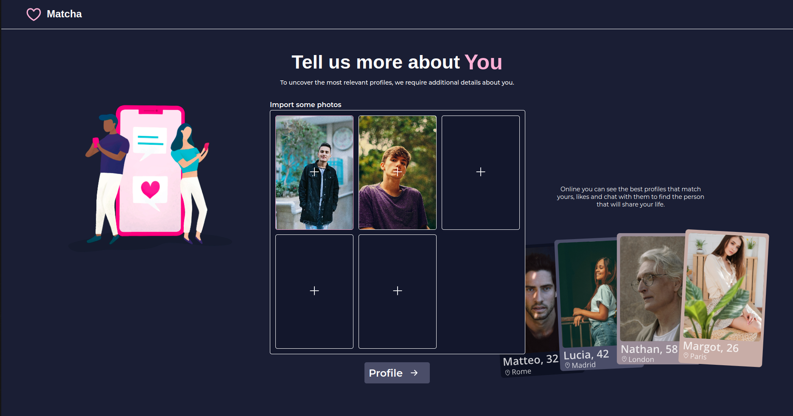
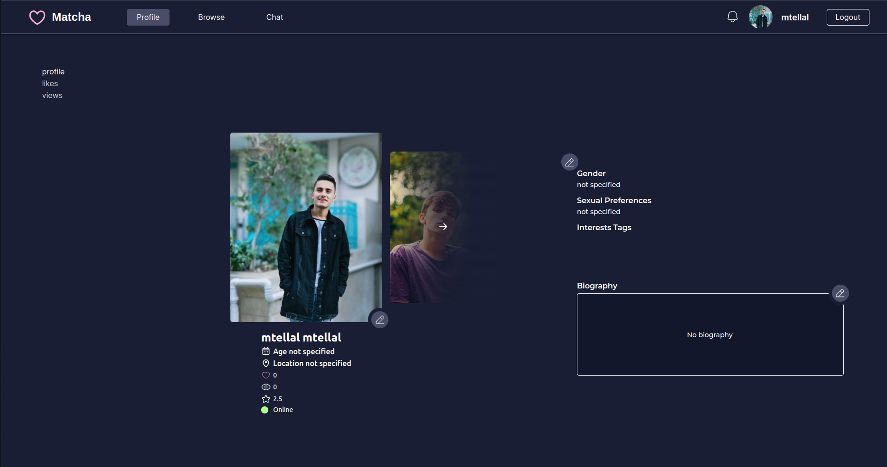
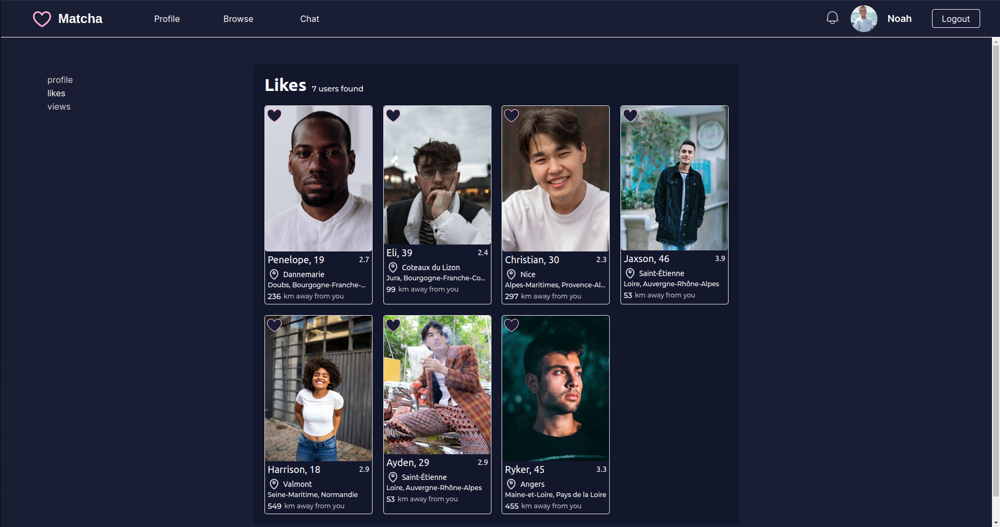
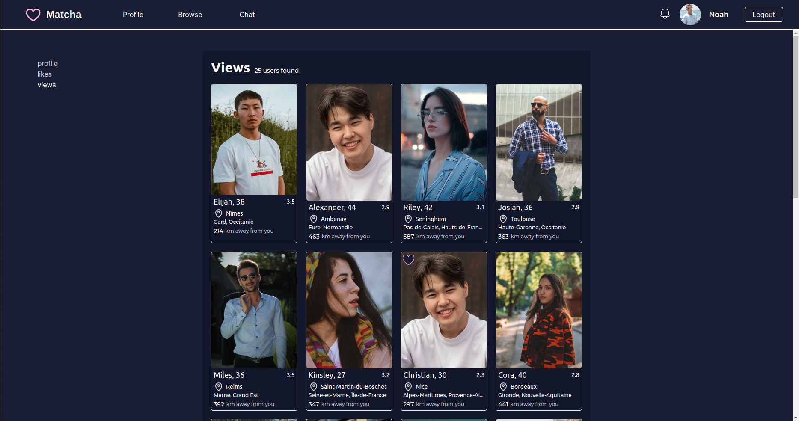
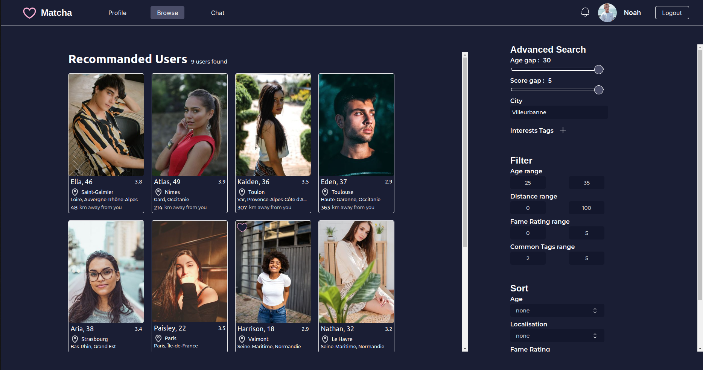
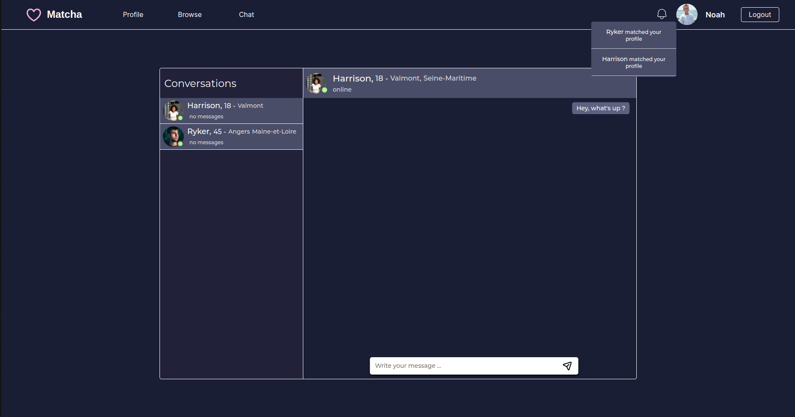

# matcha

## Introduction 

```
This project aims to create a dating website.

You will need to create an application that allows two potential
lovers to meet, from the registration process to the final encounter.

Users will be able to register, log in, complete their profile, search and view the profiles
of other users, and show interest in them with a “like”, chat with those that “liked” back.
```

## How to use
- Clone the repository
- Edit `backend/.env` file, set: 
  - Valid Outlook mail credentials `MAIL_ADDRESS=` and `MAIL_PASSWORD=`
  - LocationIq api key `LOCATIONIQ_API_KEY=`
    
    If you can't or don't want to set these variables :
    - You can bypass the mail verification by making a `/user/signup?fakeUser=true` request (ex `curl` or `postman`), this'll create an user and return an access_token, set a cookie `access_token` with this token and go to `/profile`
    - You can let empty the locationiq but the automatic location detection will fail
      
- Run `docker compose up --build`
- Connect to `localhost:8080`

 
### Frontend 

#### Stack
- React
- axios
- react-router
- Geolcoation browser api
-socket.io


### Backend

#### Stack 
- Nodejs
- Express
- multer
- sharp
- axios
- socket.io












