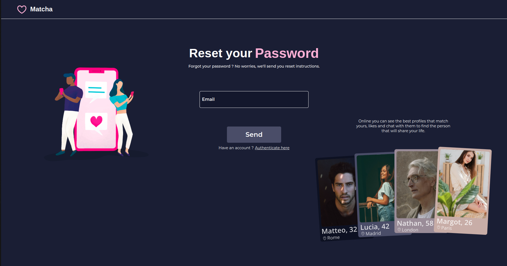
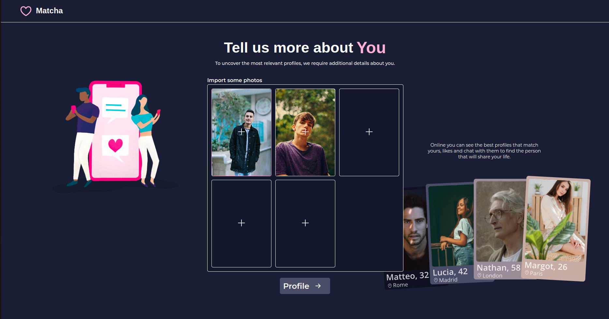
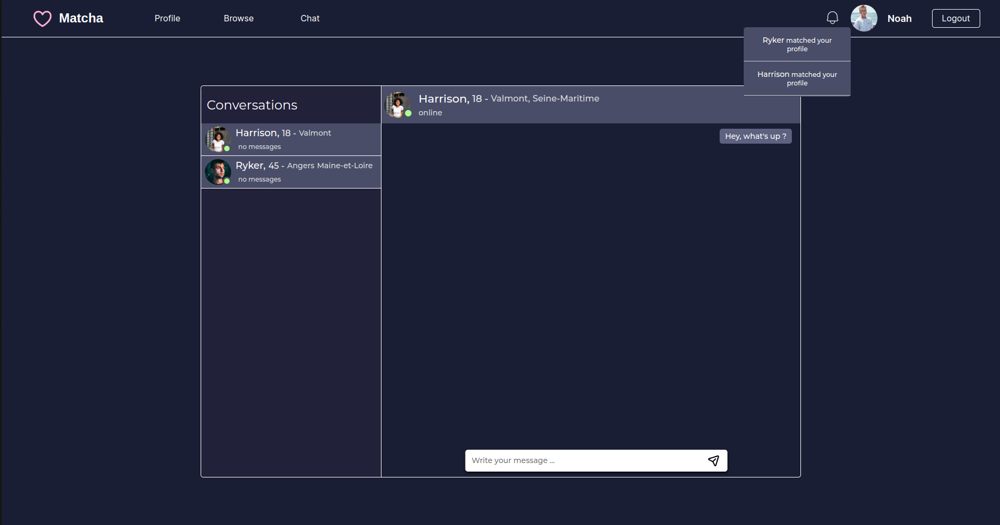

# Matcha

This project aims to create a dating website.

You will need to create an application that allows two potential
lovers to meet, from the registration process to the final encounter.

Users will be able to register, log in, complete their profile, search and view the profiles
of other users, and show interest in them with a “like”, chat with those that “liked” back.

## Use and Configuration 

Clone the repository
```
git@github.com:mtellal/matcha_prod.git
```

Add `matcha.mezyann.fr` to your hosts:
```
127.0.0.1 matcha.mezyann.fr
```

### Fast Use 

> It bypass the signup functionalities and the API Keys setup

Launch services:
```
docker compose up 
```

Create fake users
```
cd  backend/
npm run createUsers 250
``` 

Connect to a fake user by setting the `access_token` and requesting `http://matcha.mezyann.fr/profile`:
```
User Created  Jaylen  - access_token: eyJhbGciOiJIUzI1Ni...
``` 

### Normal Configuration 

Set the env file in `./backend/.env`: </br>
When an user register, this mail address sent a confirmation link to the user's address. By default it uses `gmail` so you need to set a valid gmail account. 
```
MAIL_ADDRESS= 
MAIL_PASSWORD=
```
> You can bypass this step by running `npm run createUser` script or making a customized request to `http://matcha.mezyann.fr/user/signup?fakeUser=true` </br>

In the signup process a city is asked from the user. The project uses [locationiq](https://fr.locationiq.com/) API. 
```
LOCATIONIQ_API_KEY=
```

Launch services:
```
docker compose up 
```

## Scripts 

In the `./backend` directory you can find customized scripts:
- `createUsers` creates 250 users by default up to 400, users are created via the backend API 
- `deleteUsers` delete all the users records in the database 

# Site Preview









