# Matcha

Matcha is an online dating platform project. </br>

The goal is to develop a full web application that allows users to register, create and manage their profiles, browse and search for other profiles, interact with “likes”, and chat in real-time once a mutual connection is established.


## Use and Configuration 

Clone the repository
```
git@github.com:mtellal/matcha_prod.git
```

Add `matcha.mezyann.fr` to your hosts:
```
127.0.0.1 matcha.mezyann.fr
```

### Fast Use 

> It bypass the signup functionalities and the API Keys setup

Launch services:
```
docker compose up 
```

Create fake users
```
cd  backend/
npm run createUsers 250
``` 

Connect to a fake user by setting the `access_token` and requesting `http://matcha.mezyann.fr/profile`:
```
User Created  Jaylen  - access_token: eyJhbGciOiJIUzI1Ni...
``` 

### Normal Configuration 

Set the env file in `./backend/.env`: </br>
When an user register, this mail address sent a confirmation link to the user's address. By default it uses `gmail` so you need to set a valid gmail account. 
```
MAIL_ADDRESS= 
MAIL_PASSWORD=
```
> You can bypass the signup process by running `npm run createUser` script or making a customized request to `http://matcha.mezyann.fr/user/signup?fakeUser=true` </br>

In the signup process a city is asked from the user. The project uses [locationiq](https://fr.locationiq.com/) API. 
```
LOCATIONIQ_API_KEY=
```

Launch services:
```
docker compose up 
```

Finally open your web browser and go to `http://matcha.mezyann.fr`

# Site Preview

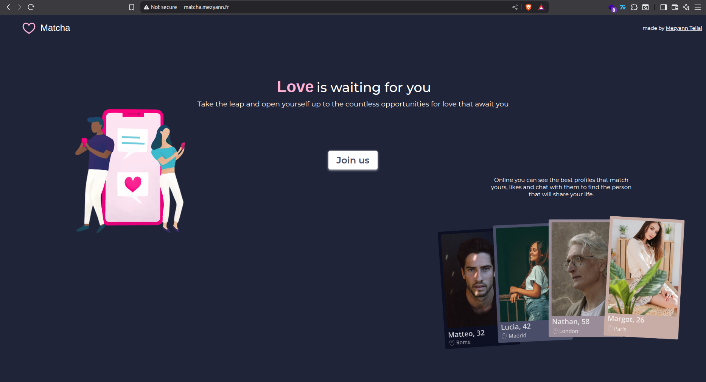
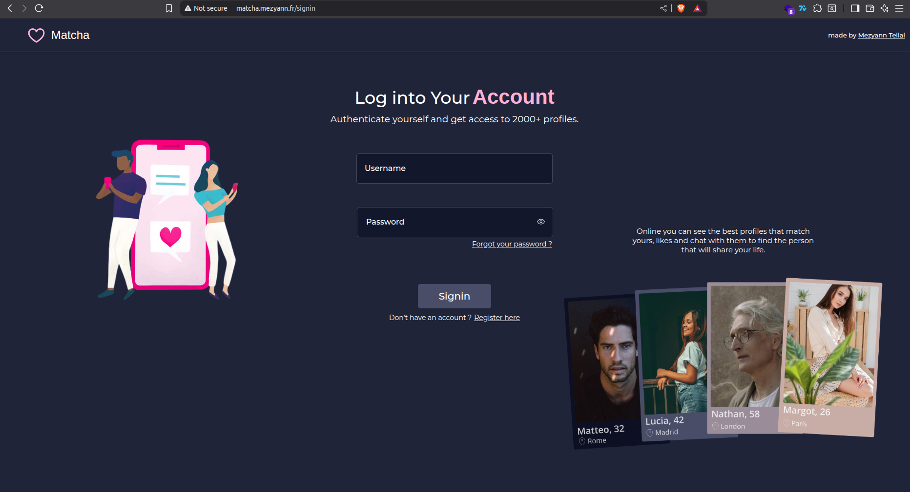
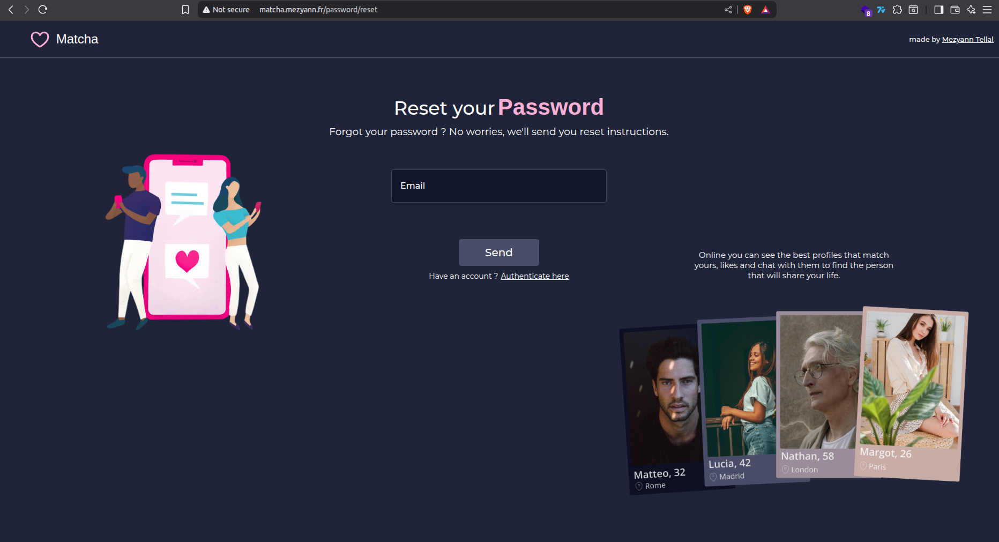
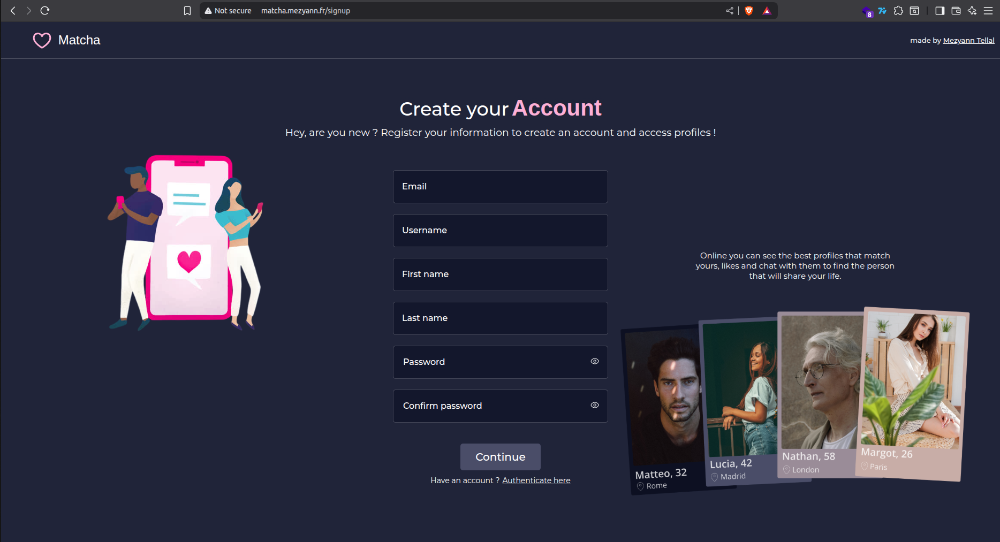
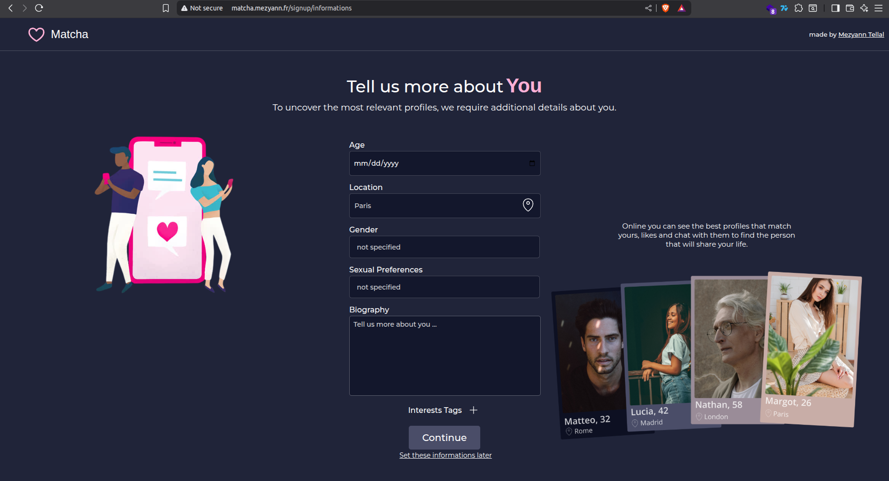
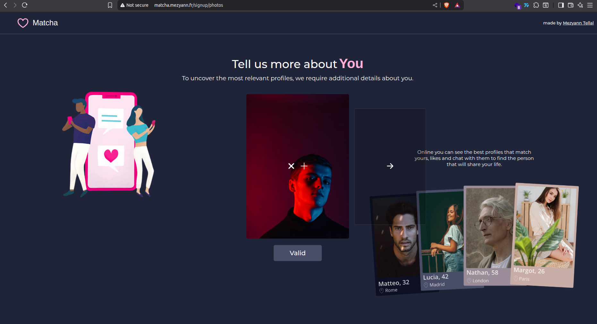
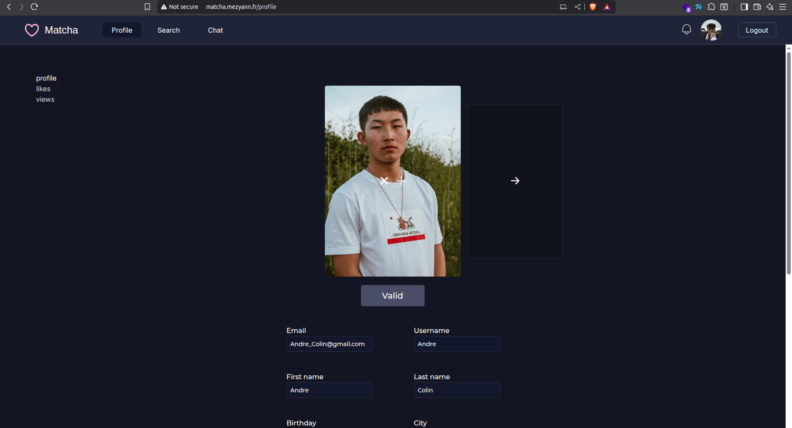
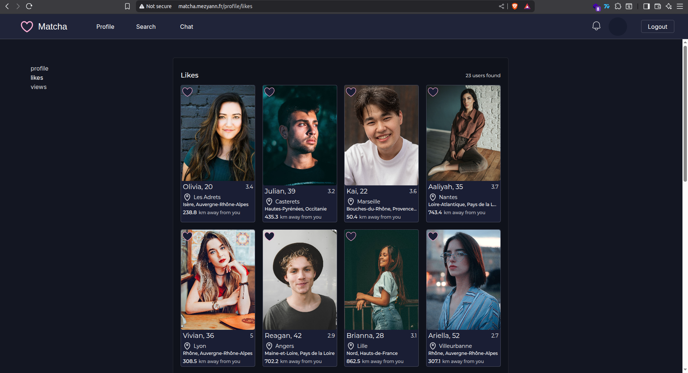
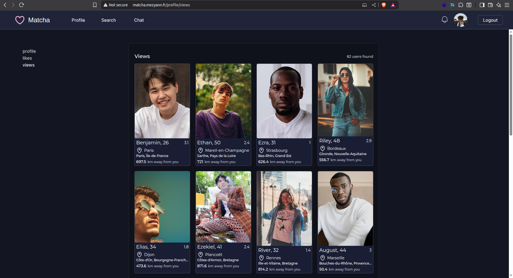
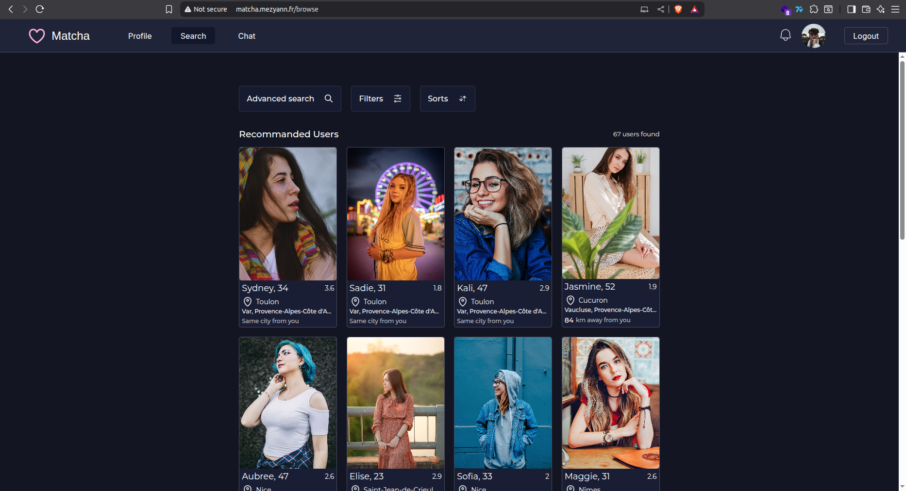
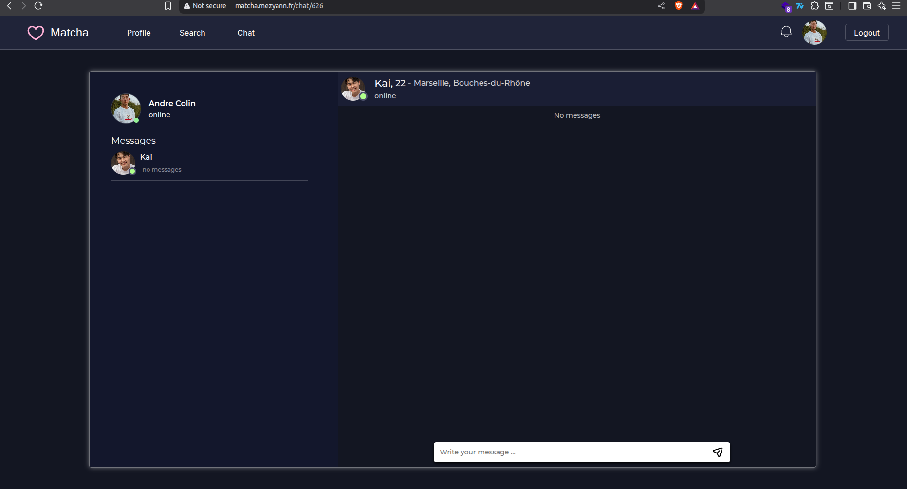
